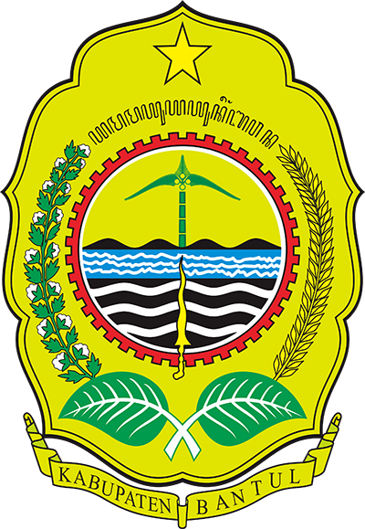

<p align="center">
    
</p>

<h1 align="center">SIGAPAN - Sistem Informasi Garda Pangan</h1>

<p align="center">
    <strong>Sistem Pemantauan Harga Komoditas Pangan di Pasar Rakyat Kabupaten Bantul</strong>
</p>

<p align="center">
    <a href="https://laravel.com"></a>
    <a href="https://www.php.net"></a>
    <a href="https://tailwindcss.com"></a>
    <a href="#"></a>
</p>

---

## 📋 Table of Contents

- [Tentang SIGAPAN](#-tentang-sigapan)
- [Fitur Utama](#-fitur-utama)
- [Teknologi yang Digunakan](#-teknologi-yang-digunakan)
- [Requirements](#-requirements)
- [Instalasi](#-instalasi)
- [Struktur Database](#-struktur-database)
- [Role & Permission](#-role--permission)
- [Panduan Penggunaan](#-panduan-penggunaan)
- [API Endpoints](#-api-endpoints)
- [Template yang Digunakan](#-template-yang-digunakan)
- [Struktur Folder](#-struktur-folder)
- [FAQ](#-faq)
- [Tim Pengembang](#-tim-pengembang)

---

## 🍚 Tentang SIGAPAN

**SIGAPAN (Sistem Informasi Garda Pangan)** adalah aplikasi web berbasis Laravel yang dikembangkan untuk memantau dan mengelola harga komoditas pangan di pasar-pasar rakyat Kabupaten Bantul, Daerah Istimewa Yogyakarta.

Aplikasi ini membantu Dinas Komunikasi dan Informatika (Diskominfo) Kabupaten Bantul dalam:
- Memantau fluktuasi harga komoditas pangan secara real-time
- Menyediakan informasi harga kepada masyarakat
- Menganalisis trend dan perbandingan harga antar pasar
- Mengelola data pasar dan komoditas secara terpusat

---

## ✨ Fitur Utama

### 🏪 Landing Page (Publik)
| Fitur | Deskripsi |
|-------|-----------|
| **Harga Harian Komoditas** | Menampilkan harga komoditas terkini dengan indikator trend (naik/turun/stabil) |
| **Daftar Pasar** | Informasi lengkap pasar rakyat di Kabupaten Bantul dengan peta lokasi |
| **Detail Pasar** | Profil pasar beserta fasilitas dan komoditas yang tersedia |
| **Matriks Harga** | Perbandingan harga komoditas di semua pasar dalam bentuk matriks |
| **Trend Harga** | Grafik visualisasi pergerakan harga komoditas dari waktu ke waktu |
| **Perbandingan Harga** | Membandingkan harga antar pasar |
| **Tabel Harga** | Data harga dalam format tabel dengan fitur download PDF |

### 🔐 Panel Admin
| Fitur | Deskripsi |
|-------|-----------|
| **Dashboard** | Overview statistik sistem (berbeda tampilan untuk admin dan lurah) |
| **Manajemen Harga Bapok** | Input dan update harga komoditas harian per pasar |
| **Manajemen Komoditas** | CRUD data komoditas dengan kategori dan gambar |
| **Manajemen User** | Kelola pengguna sistem dengan role-based access |
| **Manajemen Role & Permission** | Pengaturan hak akses pengguna |
| **Pengaturan Navigasi** | Konfigurasi menu sidebar dinamis |
| **Preferences** | Pengaturan preferensi sistem |

### 📱 Progressive Web App (PWA)
- Mendukung instalasi sebagai aplikasi native
- Offline capability dengan service worker

---

## 🛠 Teknologi yang Digunakan

### Backend
| Teknologi | Versi | Keterangan |
|-----------|-------|------------|
| PHP | ^8.2 | Runtime |
| Laravel | 12.x | Framework |
| Spatie Permission | ^6.24 | Role & Permission Management |
| Laravel Breeze | ^2.3 | Authentication Scaffolding |
| Yajra DataTables | ^12.0 | Server-side DataTables |
| Laravel DomPDF | ^3.1 | PDF Generation |
| Laravel Breadcrumbs | ^10.0 | Breadcrumb Navigation |
| Laravel PWA | ^2.0 | Progressive Web App |

### Frontend
| Teknologi | Versi | Keterangan |
|-----------|-------|------------|
| TailwindCSS | ^4.1 | CSS Framework |
| Alpine.js | ^3.4 | JavaScript Framework |
| Vite | ^6.0 | Build Tool |
| ApexCharts | ^5.3 | Chart Library |
| Leaflet | ^1.9 | Maps Library |
| DataTables | 2.3.4 | Table Plugin |

---

## 📦 Requirements

- **PHP** >= 8.2
- **Composer** >= 2.0
- **Node.js** >= 14.x
- **NPM** >= 6.x
- **MySQL** >= 8.0 atau **MariaDB** >= 10.4
- **Git**

---

## 🚀 Instalasi

### 1. Clone Repository
```bash
git clone https://github.com/your-repo/sigapan_diskominfo.git
cd sigapan_diskominfo
```

### 2. Install Dependencies
```bash
# Install PHP dependencies
composer install

# Install Node.js dependencies
npm install
```

### 3. Environment Setup
```bash
# Copy environment file
cp .env.example .env

# Generate application key
php artisan key:generate
```

### 4. Konfigurasi Database
Edit file `.env` dan sesuaikan konfigurasi database:
```env
DB_CONNECTION=mysql
DB_HOST=127.0.0.1
DB_PORT=3306
DB_DATABASE=sigapan_db
DB_USERNAME=root
DB_PASSWORD=your_password
```

### 5. Migrasi & Seeding
```bash
# Jalankan migrasi database dengan seeder
php artisan migrate:fresh --seed
```

### 6. Storage Link
```bash
php artisan storage:link
```

### 7. Build Assets
```bash
# Development
npm run dev

# Production
npm run build
```

### 8. Jalankan Aplikasi
```bash
# Menggunakan composer script (recommended)
composer dev

# Atau manual
php artisan serve
```

Akses aplikasi di: `http://127.0.0.1:8000`

---

## 🗄 Struktur Database

### Entity Relationship

```
┌─────────────────┐       ┌──────────────────┐       ┌─────────────────┐
│   ref_kecamatan │       │   ref_kalurahan  │       │    ref_dusun    │
├─────────────────┤       ├──────────────────┤       ├─────────────────┤
│ id              │◄──────│ id_kecamatan     │◄──────│ id_kalurahan    │
│ nama_kecamatan  │       │ nama_kalurahan   │       │ nama_dusun      │
└─────────────────┘       └──────────────────┘       └─────────────────┘
        │
        ▼
┌─────────────────┐       ┌──────────────────────┐
│      pasar      │       │  harga_bapok_harian  │
├─────────────────┤       ├──────────────────────┤
│ id              │◄──────│ id_pasar             │
│ nama_pasar      │       │ tanggal              │
│ id_kecamatan    │       │ data_harga (JSON)    │
│ alamat_lengkap  │       │ status               │
│ latitude        │       │ created_by           │
│ longitude       │       │ verified_by          │
│ is_monitored    │       │ is_integrated        │
└─────────────────┘       └──────────────────────┘

┌────────────────────┐       ┌─────────────────┐
│ kategori_komoditas │       │    komoditas    │
├────────────────────┤       ├─────────────────┤
│ id                 │◄──────│ kategori_id     │
│ nama_kategori      │       │ nama_komoditas  │
│ is_active          │       │ satuan          │
└────────────────────┘       │ harga_acuan     │
                             │ images          │
                             │ icon            │
                             │ is_active       │
                             └─────────────────┘
```

### Tabel Utama

| Tabel | Deskripsi |
|-------|-----------|
| `users` | Data pengguna sistem |
| `users_profile` | Profil lengkap pengguna |
| `pasar` | Data pasar rakyat |
| `komoditas` | Data komoditas pangan |
| `kategori_komoditas` | Kategori komoditas |
| `harga_bapok_harian` | Harga komoditas harian per pasar (JSON) |
| `stok_bapok_mingguan` | Stok komoditas mingguan |
| `ref_kecamatan` | Referensi kecamatan |
| `ref_kalurahan` | Referensi kelurahan/desa |
| `ref_dusun` | Referensi dusun |
| `navigations` | Menu navigasi dinamis |
| `preferences` | Pengaturan preferensi sistem |

---

## 👥 Role & Permission

### Daftar Role

| ID | Role | Deskripsi |
|----|------|-----------|
| 1 | Developer | Akses penuh ke semua fitur termasuk pengembangan |
| 2 | Superadmin | Akses penuh ke semua fitur administrasi |
| 3 | Admin | Akses ke fitur administrasi terbatas |
| 4 | User | Akses dasar (lurah pasar) |

### Mapping User Lurah ke Pasar

| User ID | Pasar |
|---------|-------|
| 3 | Pasar Bantul |
| 4 | Pasar Niten |
| 5 | Pasar Imogiri |
| 6 | Pasar Piyungan |
| 7 | Pasar Pundong |

---

## 📖 Panduan Penggunaan

### Landing Page
1. Akses `http://127.0.0.1:8000/sigapan` untuk halaman utama
2. Lihat harga komoditas terkini dengan indikator trend
3. Gunakan fitur pencarian untuk mencari komoditas
4. Akses menu navigasi untuk fitur lainnya (Daftar Pasar, Trend Harga, dll)

### Admin Panel
1. Login melalui `/login` dengan akun yang sudah terdaftar
2. Dashboard menampilkan statistik sesuai role pengguna
3. Menu sidebar menampilkan fitur sesuai permission

### Update Harga (Lurah)
1. Login sebagai user lurah (ID 3-7)
2. Akses menu "Update Harga" di sidebar
3. Input harga komoditas untuk pasar yang ditangani
4. Simpan dan verifikasi data harga

---

## 🔌 API Endpoints

### Public API

| Method | Endpoint | Deskripsi |
|--------|----------|-----------|
| GET | `/api/chart-data` | Data untuk grafik trend harga |

### Admin API (Auth Required)

| Method | Endpoint | Deskripsi |
|--------|----------|-----------|
| POST | `/admin/harga-bapok/update-harga` | Update harga komoditas |
| GET | `/admin/harga-bapok/get-data` | Ambil data harga berdasarkan filter |
| GET | `/admin/harga-bapok/get-pending-items` | Ambil item pending |
| POST | `/admin/harga-bapok/store-komoditas` | Tambah komoditas baru |

---

## 🎨 Template yang Digunakan

### Admin Template
- **Trezo** - Dashboard admin modern dengan TailwindCSS
- Demo: https://trezo-twcss.envytheme.com/lms-index.html

### Landing Template
- **Martex** - Landing page modern dengan TailwindCSS
- Demo: https://martex-tailwindcss.ibthemespro.com/index.html

### Build Custom CSS Landing
```bash
# Watch mode untuk development
npm run build-styling-landing

# Copy hasil build ke public
cp dist/landing/style.css public/assets/landing/css/
```

### DataTables
- **DataTables Tailwind** v2.3.4
- Demo: https://datatables.net/examples/styling/tailwind.html

---

## 📁 Struktur Folder

```
sigapan_diskominfo/
├── app/
│   ├── Console/           # Artisan commands
│   ├── Enums/             # Enum definitions (RoleEnum, etc)
│   ├── Events/            # Event classes
│   ├── Helpers/           # Helper functions
│   ├── Http/
│   │   ├── Controllers/
│   │   │   ├── Admin/     # Admin controllers
│   │   │   ├── Api/       # API controllers
│   │   │   ├── Auth/      # Authentication controllers
│   │   │   ├── Landing/   # Landing page controllers
│   │   │   └── Lurah/     # Lurah controllers
│   │   ├── Middleware/    # HTTP middleware
│   │   ├── Requests/      # Form requests
│   │   └── Services/      # Service classes
│   ├── Mail/              # Mailable classes
│   ├── Models/            # Eloquent models
│   ├── Providers/         # Service providers
│   ├── Traits/            # Reusable traits
│   └── View/              # View composers & components
├── bootstrap/             # Application bootstrap
├── config/                # Configuration files
├── database/
│   ├── factories/         # Model factories
│   ├── migrations/        # Database migrations
│   └── seeders/           # Database seeders
├── lang/                  # Localization files (en, id)
├── public/                # Public assets
│   ├── assets/            # Admin & landing assets
│   ├── images/            # Image files
│   └── build/             # Vite build output
├── resources/
│   ├── css/               # Source CSS files
│   ├── js/                # Source JS files
│   └── views/             # Blade templates
│       ├── admin/         # Admin views
│       ├── auth/          # Auth views
│       ├── dashboard/     # Dashboard views
│       ├── landing/       # Landing page views
│       └── layouts/       # Layout templates
├── routes/                # Route definitions
├── storage/               # Storage files
└── tests/                 # Test files
```

---

## 🧪 Testing

```bash
# Run all tests
php artisan test

# Run specific test
php artisan test --filter=TestName
```

---

## 📝 Environment Variables

| Variable | Description | Example |
|----------|-------------|---------|
| `APP_NAME` | Nama aplikasi | SIGAPAN |
| `APP_ENV` | Environment | local/production |
| `APP_DEBUG` | Mode debug | true/false |
| `APP_URL` | URL aplikasi | http://127.0.0.1:8000 |
| `DB_CONNECTION` | Driver database | mysql |
| `DB_HOST` | Host database | 127.0.0.1 |
| `DB_PORT` | Port database | 3306 |
| `DB_DATABASE` | Nama database | sigapan_db |
| `DB_USERNAME` | Username database | root |
| `DB_PASSWORD` | Password database | - |

---

## ❓ FAQ

#### Apakah itu laravel pint?
Alat untuk merapihkan penulisan PHP, cara penggunaan `./vendor/bin/pint`

#### Arsitektur apa yang digunakan?
Minimal dengan arsitektur MVC, bisa juga menambahkan service pattern, dan memungkinkan juga memakai repository jika diperlukan.

#### Apakah wajib menggunakan service dan repository?
Penggunaan service dan repository adalah optional.

#### Kapan penggunaan service pattern itu?
Penggunaan service pattern ketika banyak logic yang bisa dipanggil ulang.

#### Kapan penggunaan repository pattern itu?
Penggunaan repository pattern ketika mengakses data selain database atau ketika query manual.

---

## 🔗 Useful Links

- [Laravel 12 Documentation](https://laravel.com/docs/12.x/)
- [Spatie Laravel Permission](https://spatie.be/docs/laravel-permission/v6/introduction/)
- [TailwindCSS Documentation](https://tailwindcss.com/docs)
- [Alpine.js Documentation](https://alpinejs.dev/)
- [ApexCharts Documentation](https://apexcharts.com/docs/)
- [Leaflet Documentation](https://leafletjs.com/reference.html)

---

## 📄 License

Project ini dilisensikan di bawah [MIT License](https://opensource.org/licenses/MIT).

---

## 👨‍💻 Tim Pengembang

<p align="center">
    <strong>Developed by</strong>
</p>

<p align="center">
    <strong>Angelina Derrel Mona Felisya</strong><br>
    <strong>Abdul Rafi</strong><br>
    <strong>Muhammad Damar Zaky Al-ayyubi</strong><br>
    <strong>Muhammad Rofi Fadhil</strong>
</p>

<p align="center">
    <em>Dinas Komunikasi dan Informatika Kabupaten Bantul</em><br>
    <em>Daerah Istimewa Yogyakarta</em>
</p>

---

<p align="center">
    <sub>© 2026 SIGAPAN - Sistem Informasi Garda Pangan Kabupaten Bantul</sub>
</p>
